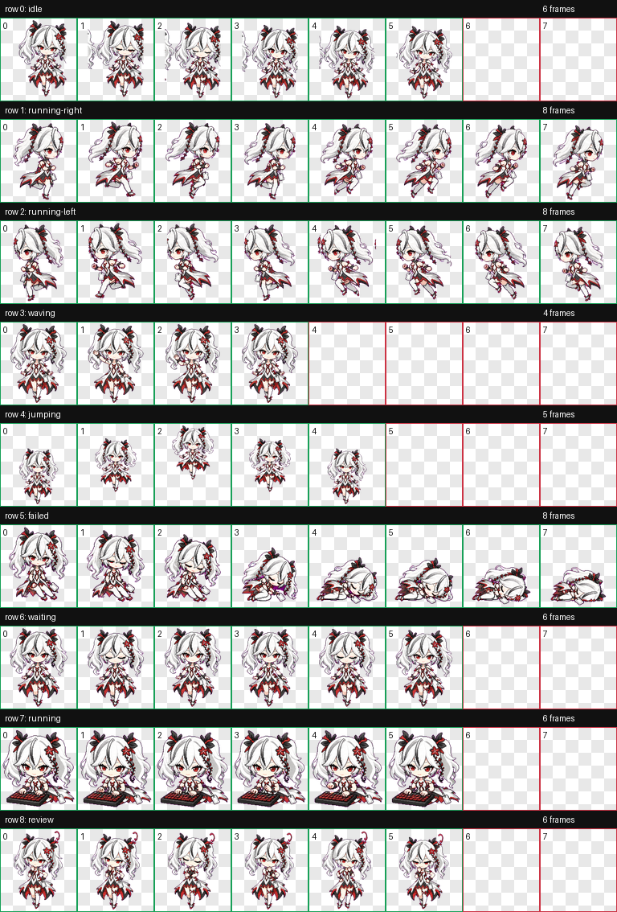

# 椿 / Camellya Codex Pet

一只 Codex 桌面电子宠物，基于《鸣潮》角色“椿 / Camellya”的同人 Q 版像素化设计。她保留了白色长发、红黑白主配色、锐利眼神和冷艳危险感，同时简化成适合桌面悬浮显示的小尺寸宠物。

> Unofficial fan-made Codex desktop pet inspired by Camellya / 椿 from Wuthering Waves.



## Install

Clone this repository directly into your Codex pets folder:

PowerShell:

```powershell
git clone https://github.com/banmengyi/codex-pet-camellya.git "$env:USERPROFILE\.codex\pets\tsubaki"
```

macOS / Linux:

```bash
git clone https://github.com/banmengyi/codex-pet-camellya.git ~/.codex/pets/tsubaki
```

Then restart Codex or refresh the pet list.

## Files

```text
.
|-- pet.json
|-- spritesheet.webp
|-- qa/
|   |-- contact-sheet.png
|   |-- validation.json
|   |-- review.json
|   `-- previews/
|       |-- idle.gif
|       |-- running-right.gif
|       |-- running-left.gif
|       |-- waving.gif
|       |-- jumping.gif
|       |-- failed.gif
|       |-- waiting.gif
|       |-- running.gif
|       `-- review.gif
|-- metadata/
|   `-- pet_request.json
|-- LICENSE
|-- NOTICE.md
`-- README.md
```

## Animation States

| Codex state | Design | Preview |
| --- | --- | --- |
| `idle` | 待机站立，轻微眨眼和摆动 |  |
| `running-right` | 向右移动 |  |
| `running-left` | 向左移动 |  |
| `waving` | 冷淡但礼貌的招呼 |  |
| `jumping` | 完成后的得意小庆祝 |  |
| `failed` | 低能量蜷缩 / 睡态反应 |  |
| `waiting` | 等待指令 |  |
| `running` | 坐在小键盘前工作 |  |
| `review` | 歪头思考 / 检查结果 |  |

## QA

The generated atlas was validated locally:

- Format: WebP / RGBA
- Size: `1536x1872`
- Cell size: `192x208`
- Transparent RGB residue pixels: `0`
- Validation errors: `0`

See [qa/validation.json](qa/validation.json) and [qa/review.json](qa/review.json).

## License And Notice

This repository is a non-commercial fan asset package, not an official or OSI-style open-source project. See [LICENSE](LICENSE) and [NOTICE.md](NOTICE.md).

Wuthering Waves, Camellya / 椿, and related names, characters, and visual identity belong to their respective rights holders. This project is unofficial and is not affiliated with, sponsored by, endorsed by, or approved by any rights holder.
